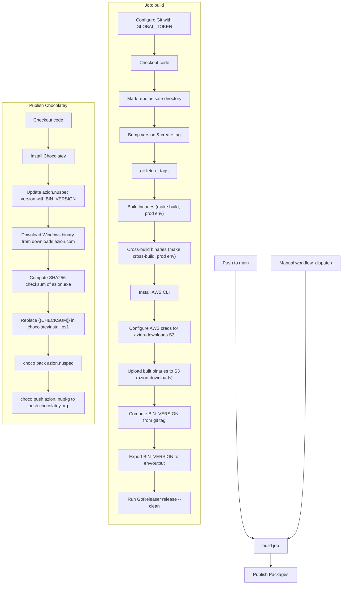

```mermaid
flowchart TB

    %% Triggers
    A[Push to main] --> B[build job]
    A2[Manual workflow_dispatch] --> B

    %% Build job
    subgraph Build_Job["Job: build"]
        direction TB
        B1[Configure Git with GLOBAL_TOKEN] --> B2[Checkout code]
        B2 --> B3[Mark repo as safe directory]
        B3 --> B4[Bump version & create tag]
        B4 --> B5[git fetch --tags]
        B5 --> B6["Build binaries (make build, prod env)"]
        B6 --> B7["Cross-build binaries (make cross-build, prod env)"]
        B7 --> B8[Install AWS CLI]
        B8 --> B9[Configure AWS creds for azion-downloads S3]
        B9 --> B10["Upload built binaries to S3 (azion-downloads)"]
        B10 --> B11[Compute BIN_VERSION from git tag]
        B11 --> B12[Export BIN_VERSION to env/output]
        B12 --> B13[Run GoReleaser release --clean]
    end

    %% Downstream jobs
    B --> C[Publish Packages]

    %% Chocolatey job
    subgraph Choco_Job["Publish Chocolatey"]
        direction TB
        C1[Checkout code] --> C2[Install Chocolatey]
        C2 --> C3["Update azion.nuspec version with BIN_VERSION"]
        C3 --> C4["Download Windows binary from downloads.azion.com"]
        C4 --> C5[Compute SHA256 checksum of azion.exe]
        C5 --> C6["Replace {{CHECKSUM}} in chocolateyinstall.ps1"]
        C6 --> C7["choco pack azion.nuspec"]
        C7 --> C8["choco push azion.<BIN_VERSION>.nupkg to push.chocolatey.org"]
    end

```
